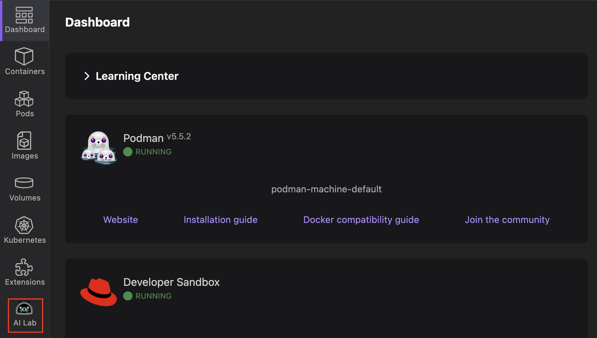

# Installing the Podman AI Lab extension

The AI Lab extension extends the capabilities of Podman Desktop for Large Language Models (LLMs). Its installation is just a click away if you already have Podman Desktop installed.

#### Prerequisites

- [Install Podman Desktop](/docs/installation).

#### Procedure

Perform one of the following steps:

- <a href="podman-desktop:extension/redhat.ai-lab">**Click to launch the installation**</a> of Podman AI Lab in Podman Desktop.
- Go to **Extensions > Catalog** and [install the Podman AI Lab extension](/tutorial/running-an-ai-application#installing-the-extension).

#### Verification

1. Check the left navigation pane, which shows the Podman AI Lab icon.
   
