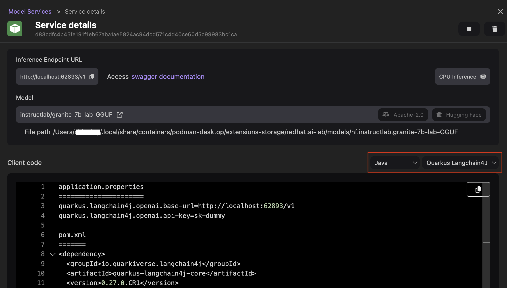

# Starting an inference server for a model

Once a model is downloaded, a model service can be started. A model service is an inference server that runs in a container and exposes the model through the well-known chat API common to many providers.

#### Prerequisites

- [Podman AI Lab installed](/docs/ai-lab/installing).
- [Model downloaded](/docs/ai-lab/download-model).

#### Procedure

1. Click the Podman AI Lab icon in the left navigation pane.
1. In the Podman AI Lab navigation bar, click **Services**.
1. Click the **New Model Service** button at the top right corner of the page. The Creating Model service page opens.

   :::note

   On a macOS machine, you get a notification to [create a GPU-enabled Podman machine](/docs/podman/creating-a-podman-machine) to run your GPU workloads. Click the **Create GPU enabled machine** button to proceed.

   :::

1. Select the model for which you want to start an inference server from the dropdown list, and edit the port number if needed.
1. Click **Create service**. The inference server for the model is being started, and this requires some time.
   

1. Click the **Open service details** button.

#### Verification

1. View the details of the inference server.
   
1. Optional: Customize the client code based on your programming language to access the model through the inference server. For example, set the code language to `Java` and `Quarkus Langchain4J`, and view the updated code snippet.
   
