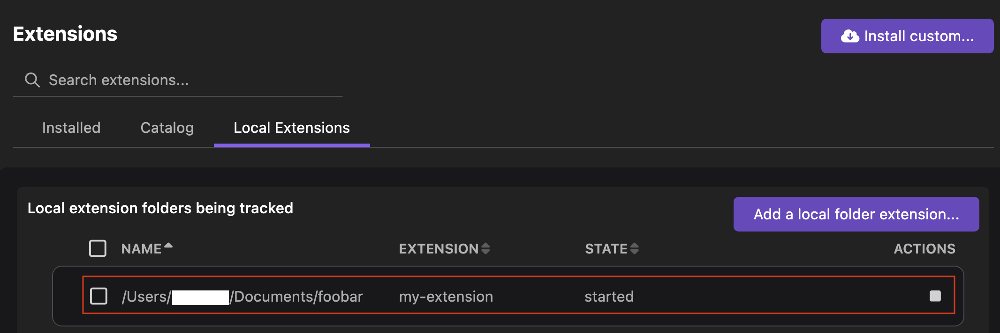

# Debugging a local extension

After developing an extension, you can start and debug the extension from the UI. This reduces the time spent identifying and fixing issues within the extension's code before it is deployed. When you add a local folder that contains your extension to the UI, Podman Desktop watches the folder, loads the extension, and keeps track of it. You can also stop or untrack the extension.

#### Prerequisites

- [A running Podman machine](/docs/podman/creating-a-podman-machine).
- You have [developed an extension](/docs/extensions/developing) locally.

#### Procedure

1. Go to **Settings > Preferences > Extensions**.
1. Click the toggle button to enable the development mode.
1. Go to **Extensions** and select the **Local Extensions** tab.
1. Click **Add a local folder extension...**.
1. Select the folder that contains your extension.
1. Check the extension is in the `started` state on the same page.
   

#### Verification

1. Go to **Extensions**, search for the local extension, and confirm that it is `ACTIVE`.
1. Check your extension's functionality in the UI.
