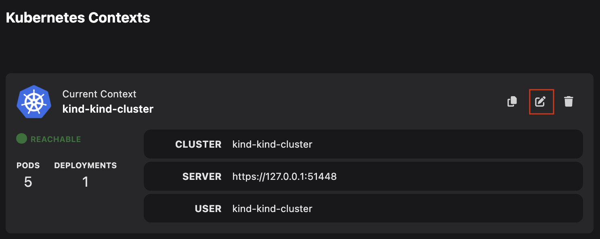
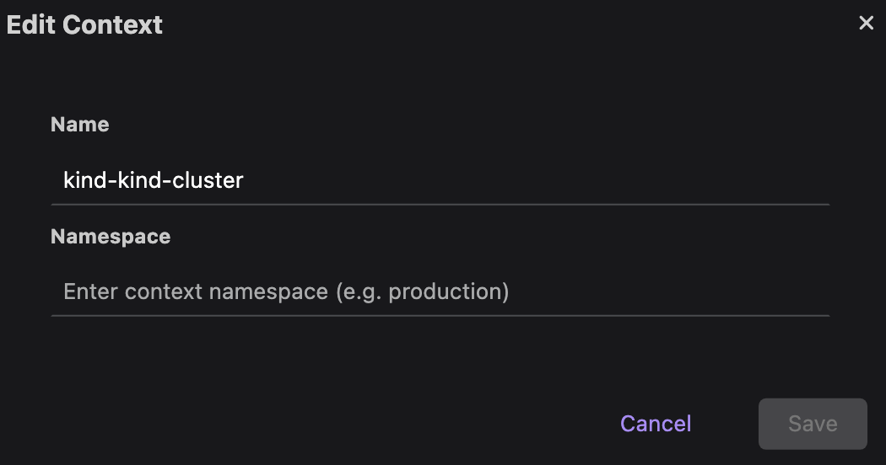
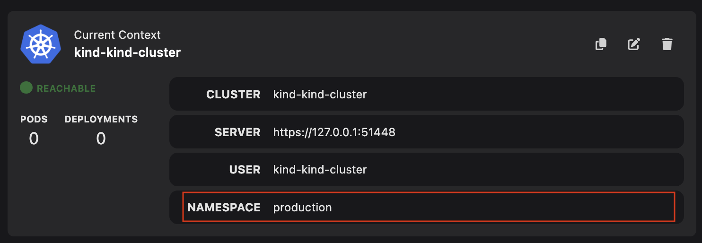

# Managing a Kubernetes context

Within Kubernetes, a context is useful to:

- Manage multiple development, testing, and production environments.
- Simplify your interaction when working with multiple clusters, users, and namespaces.

You can edit or duplicate a context using the UI. This helps in defining contexts with different configurations within your Kubernetes configuration file. Having contexts with different configurations enables easy switching between environments during development.

#### Prerequisites

- [A running Podman machine](/docs/podman/creating-a-podman-machine).
- [A Kubernetes cluster](/docs/kubernetes/creating-a-kube-cluster).

#### Procedure: Edit a context

1. Go to the **Settings > Kubernetes** page.
1. Click the **Edit Context** icon. The Edit Context popup window opens.
   
1. Edit any of the following context details:
   - Name
   - Cluster
   - User
   - Namespace
     
1. Click **Save**.

#### Procedure: Duplicate a context

1. Go to the **Settings > Kubernetes** page.
1. Click the **Duplicate Context** icon.

#### Verification

- _Edit a context_: View the updated context details on the same page.
  
- _Duplicate a context_: View the duplicated context on the same page.

#### Additional resources

- [Viewing and selecting the current Kubernetes context](/docs/kubernetes/viewing-and-selecting-current-kubernetes-context)
